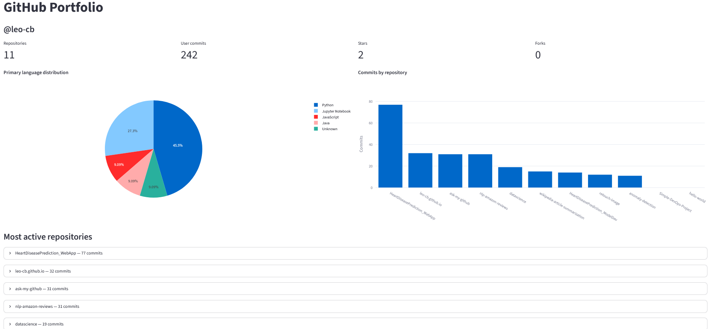

# Ask My GitHub

A retrieval-augmented generation (RAG) system specialized for
GitHub and code. It scrapes a user's public repositories using Github API, builds a FAISS index, and answers questions with a
fast one-shot RAG path or a slower agentic path built on LangGraph.

<p align="center">
  
  <br>
  <em>Dashboard for a GitHub user: repo metrics come from the SQLite repo-stats table, while per-repository summaries and technologies are retrieved from the FAISS vector store.</em>
</p>

## Features

- Async, parallel scrape of whole repositories (source files + high-signal
  metadata files), with language-aware chunking.
- **Fast path** — one-shot RAG using LangChain LCEL (cloud or local Ollama LLM). Path selected via env var `IS_FAST_RAG` = 1.

  ```mermaid
  flowchart LR
      A[User question] --> B[FAISS retriever]
      B --> C[Top-k relevant chunks]
      C --> D[QA prompt + LLM]
      D --> E[Answer + sources]
  ```

- **Agentic path** — a Corrective RAG LangGraph with an LLM router, query
  rewriting, document grading, and a ReAct tool-agent fallback (GitHub code
  search / file read / repo stats). Path selected via env var `IS_FAST_RAG` != 1 (or inexistant key)

  ```mermaid
  flowchart TD
      A[START] --> B[Route — LLM router]
      B -->|stats| C[Stats node — SQLite repo-stats table]
      B -->|code| D[Retrieve — FAISS retriever]
      C --> E[Generate — answer]
      D --> F[Grade — document grader]
      F -->|relevant| E
      F -->|irrelevant, iterations < 3| G[Transform query — rewrite]
      G --> D
      F -->|irrelevant, iterations = 3| H[Tool fallback — ReAct agent]
      H --> I[GitHub code search / file read / repo stats]
      E --> J[Answer + sources]
      I --> J
  ```
- **Repo-level stats table** — per-repository facts (commits, stars, forks,
  language, dates, fork status) stored in a SQLite table separate from the
  vector store. An LLM router classifies each question as `stats` (answered
  from the table) or `code` (answered from the FAISS index), so repo-level
  questions ("most stars", "highest commits", "which are forks") hit the table
  while code questions search the index. Re-ingest after changing scraped
  repos to refresh both.
- Cloud (OpenAI/Anthropic/DeepSeek) and local (Ollama) LLMs, switchable per path.
  The agentic path's router and ReAct tool fallback require a
  **tool-calling-capable** model — the default (`gpt-4o-mini`) works out of the
  box, but if you switch it to Ollama use a model with solid tool support
  (e.g. `qwen2.5-coder`); smaller models can be unreliable at emitting valid
  tool calls.
- LangSmith tracing for the agentic graph, chains and OpenAI embedding.
- FAISS index and repo-stats DB persisted to disk per user.

## Requirements

- Python 3.12+


**Optional:**
- [Ollama](https://ollama.com/download) installed (if you wish to run local LLMs)
- One of these: OpenAI/Anthropic/Deepseek API key (you can use local models with Ollama instead)
- [uv](https://docs.astral.sh/uv/) (for dependency management; pip also works)
- GitHub token (recommended for higher rate limits)
- Langsmith API key (cloud LLMs tracing)

## Install

### With pip

1. Clone this repository to your local machine:
```bash
git clone https://github.com/leo-cb/ask-my-github.git
```

2. Install dependencies:
```bash
pip install -e .
```

### With uv

1. Clone this repository to your local machine:
```bash
git clone https://github.com/leo-cb/ask-my-github.git
```

2. If you don't have `uv` yet, install it first (it's a single binary / PyPI
package):

```bash
pip install uv
```

3. Then sync the project dependencies:

```bash
uv sync
```

## Configuration

Copy `.env.example` to `.env` and fill in what you need. Key variables:

| Variable | Purpose | Default |
|----------|---------|---------|
| `IS_FAST_RAG` | `1` = fast one-shot; anything else = agentic | unset (agentic) |
| `LLM_PROVIDER` | `openai` \| `anthropic` \| `deepseek` \| `ollama` | **required** (no default) |
| `OPENAI_API_KEY` / `ANTHROPIC_API_KEY` | cloud credentials | — |
| `DEEPSEEK_API_KEY` / `DEEPSEEK_MODEL` | DeepSeek (OpenAI-compatible, tool-calling) | `deepseek-chat` |
| `OLLAMA_MODEL` | any locally installed Ollama model (e.g. `qwen2.5-coder`) | `llama3.2` |
| `EMBEDDING_PROVIDER` | `fastembed` (local, ONNX) \| `openai` (cloud) | **required** (no default) |
| `EMBEDDING_MODEL` | model for the embedding provider (fastembed / `text-embedding-3-small`) | `jinaai/jina-embeddings-v2-base-code` |
| `DASHBOARD_USERS` | comma-separated GitHub usernames shown by the dashboard (one tab each); each is ingested at startup | — |
| `GITHUB_TOKEN` | GitHub auth for higher rate limits | — |
| `LANGCHAIN_API_KEY` | enables LangSmith tracing | — |
| `FAISS_DIR` | directory used to persist/load each user's FAISS store | `./.data/faiss` |

## Usage

Two interfaces are available: an **HTTP API** for answering questions
programmatically, and a **Streamlit dashboard** (below) for browsing a GitHub
user's portfolio.

### Run the API

```bash
uvicorn ask_my_github.main:app --reload
```

### API endpoints

- `POST /ingest/github` with JSON body `{"username": "octocat"}` — scrapes the
  user's repos, builds and persists the FAISS index, and saves the repo-stats
  SQLite table.
- `POST /query` with JSON body `{"question": "..."}` — answers using the fast or
  agentic path depending on `IS_FAST_RAG`.

### Dashboard

A Streamlit dashboard that renders portfolio metrics for one or more GitHub
users (one tab per user). It reads repository metadata from the `repos`
SQLite table, uses the FAISS index plus a cloud LLM to produce per-repository
summaries, and extracts the languages and libraries each repository uses.

#### Requirements

- A **cloud** LLM provider (`openai`, `anthropic`, or `deepseek`) — the
  dashboard rejects `ollama` for its summarization work.
- `DASHBOARD_USERS` set to a comma-separated list of GitHub usernames, e.g.
  `DASHBOARD_USERS=octocat,another-user`.

#### Run locally

```bash
streamlit run ask_my_github/dashboard/app.py
```

#### Run with Docker

The image listens on port **8505**. The entrypoint
(`ask_my_github.dashboard.entrypoint`) ingests **every user in
`DASHBOARD_USERS` at startup** — reusing each user's persisted index when it
exists, otherwise scraping GitHub, embedding, and saving it — and only then
launches Streamlit.

```bash
docker build -t ask-my-github-dashboard .
docker run -p 8505:8505 --env-file .env -v ./.data:/app/.data ask-my-github-dashboard
```

- `.data/` is a bind mount holding the persisted FAISS index per user
  (`.data/faiss/<username>/`) and the shared `repo_stats.db` SQLite file.
  Keep it mounted so restarts are fast and need no GitHub API access or
  re-embedding spend.
- Because ingestion happens *before* Streamlit starts, the first boot of a new
  user can take several minutes (scrape + embed); set a generous startup grace
  period if you add a health check.

#### Ingesting users manually

All ingestion goes through the shared `ingest_user()` flow, so the dashboard,
the API (`POST /ingest/github`), and the CLI stay consistent. To bulk-ingest
from the terminal:

```bash
python utils/ingest_users.py octocat another-user
```

#### Deploying to a server

The image contains code only — users and data live in `.env` and `.data/`, so
ship all three. Build once on your machine, export, and load on the server:

```bash
# local: save the image (do NOT wrap it in another tar — docker load expects
# the docker archive itself; gzip the file directly, or skip gzip)
docker save ask-my-github-dashboard:latest -o dashboard.tar
gzip dashboard.tar                      # → dashboard.tar.gz (optional)
scp dashboard.tar.gz .env ubuntu@<host>:~/ask-my-github/
scp -r .data ubuntu@<host>:~/ask-my-github/

# server: load, then run with the same bind mount
cd ~/ask-my-github
docker load -i dashboard.tar.gz
docker run -d --name ask-my-github-dashboard --restart unless-stopped \
  -p 8505:8505 --env-file .env \
  -v "$PWD/.data:/app/.data" \
  ask-my-github-dashboard:latest
```

On Windows PowerShell there is no `gzip` command, so just copy the
uncompressed `dashboard.tar` and gzip it on the server (`gzip dashboard.tar`)
before `docker load -i dashboard.tar.gz`. Point a reverse proxy (e.g. Caddy)
at port 8505 for TLS.

> On every page render, summaries and technology lists are served from
> Streamlit's in-memory cache, so no LLM calls happen after the first view.
> The cache is not persisted, however — restarting the container regenerates
> the summaries once (a handful of cheap DeepSeek calls per repo).

## Evaluation

RAG quality is measured with [DeepEval](https://docs.confident-ai.com/)
using an LLM-as-judge over a golden dataset. The harness reuses the exact
production retrieval and answer code (fast and agentic paths), so a passing
suite is a signal on the real system, not a mock.

**Metrics**

- **Retrieval** — `ContextualPrecision`, `ContextualRecall`,
  `ContextualRelevancy`: did the FAISS retriever surface the right chunks,
  miss ground-truth content, or dilute the prompt with noise?
- **Generation** — `Faithfulness` (is the answer grounded in the retrieved
  context?), `AnswerRelevancy` (does it address the question?), and a
  G-Eval `Correctness` rubric (is it factually right about the repo/code?).
- **Router** — a deterministic accuracy check that the agentic router
  classifies `stats` vs `code` questions correctly (no judge, so it is cheap).

All metrics share a single **DeepSeek judge pinned to `temperature=0.0`**, and
the eval answer model is pinned the same way, so both the answers and their
scores are reproducible run-to-run.

**Golden dataset** lives in `data/eval/` (`goldens.json` hand-curated,
`goldens_synthetic.json` generated). Generate the synthetic set from the
current FAISS index:

```bash
python utils/generate_goldens.py <username> --count 40
```

**Run the suite** (requires `pip install -e ".[dev]"` and a persisted index
for the eval user, resolved via `EVAL_USER` → `GITHUB_USERNAME` → first
`DASHBOARD_USERS` entry):

```bash
pytest tests/eval -q
```

Answers are cached to `.data/eval/cache/<user>/` (gitignored), so repeat runs
skip the answer LLM call and only the judge is re-invoked. Delete that cache
to force fresh answers after changing the index or prompts. Iterate on single
questions with `pytest tests/eval/test_fast_rag.py -k "HeartDisease" -v` and
reserve the full suite for final verification.

## Project Structure

```
ask_my_github/
  __init__.py
  main.py
  config.py
  logging_config.py
  api/
    __init__.py
    ingest.py
    query.py
  dashboard/
    __init__.py
    app.py
    entrypoint.py
    prompts.py
    service.py
  github/
    __init__.py
    ingest.py
    loader.py
    repo_stats.py
  rag/
    __init__.py
    embeddings.py
    llm.py
    prompt.py
    retriever.py
    splitter.py
    store.py
  agentic/
    __init__.py
    state.py
    tools.py
    nodes.py
    graph.py
  eval/
    __init__.py
    pipeline.py
    judge.py
    metrics.py
    dataset.py
utils/
  ingest_users.py
  generate_goldens.py
tests/
  eval/
    conftest.py
    test_retrieval.py
    test_fast_rag.py
    test_agentic_rag.py
    test_router.py
data/
  eval/
    goldens.json
docs/
  images/
    dashboard.png
.github/
  workflows/
    gitleaks.yml
Dockerfile
pyproject.toml
uv.lock
```

## License

This project is licensed under the [MIT License](LICENSE).
